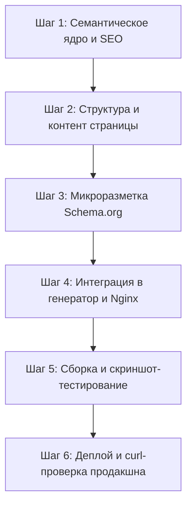

# Регламент создания новой отраслевой страницы (сектора) в «Молния Тех»

Данный документ является обязательным архитектурным и контентным стандартом для разработки и публикации любых отраслевых посадочных страниц (секторов) на сайте [molniya-tech.ru](https://molniya-tech.ru/).

---

## 1. Концепция и архитектурные ограничения

1. **DRY-генерация:** Ни одна страница сектора не пишется как изолированный HTML-файл вручную. Все страницы генерируются и синхронизируются через [scripts/build_sector_pages.py](file:///Users/breeze/Desktop/Python/Dev/молния/scripts/build_sector_pages.py).
2. **Строгая политика CSP:**
   - Никаких инлайн-скриптов `<script>...</script>` внутри страницы.
   - Никаких инлайн-обработчиков событий в HTML (`onclick`, `onchange` и т.д.).
   - Вся интерактивность — строго через внешние классы и события в `script.js`.
3. **Чистые человекопонятные URL (Clean URLs):**
   - Публичные адреса страниц не содержат `.html`: `/auto`, `/beauty`, `/health`, `/education`, `/pets`, `/repair`.
   - Для адресов с `.html` настраивается относительный 301-редирект в Nginx.
4. **Фирменная дизайн-система:**
   - Единая цветовая палитра: светлый фон (`--mt-bg: #fffefd`), фирменный акцентный цвет (`--mt-accent: #C6543B`), темные заголовки (`--mt-text-heading: #201B15`).
   - Официальный фирменный знак `molniya-mark` (шестилучевая искра с оранжевым лучом на 60° и центральным кольцом) для всех брендовых иконок и финального CTA.

---

## 2. Пошаговый пайплайн создания страницы



---

### Шаг 1. Семантическое ядро и SEO-подготовка

1. **Анализ целевой аудитории сектора:**
   - Определить ключевые роли: собственник, управляющий, администратор, мастер/специалист.
   - Определить отраслевую терминологию (например: посты/боксы для авто, рабочие места/кресла для бьюти, кабинеты для клиник).
   - Выявить главные боли: простои, накладки в расписании, ручной подсчет зарплат, уход клиентов.
2. **Сбор семантического ядра (ВЧ / СЧ / НЧ + LSI):**
   - «программа для <сферы>»
   - «CRM для <сферы>»
   - «онлайн-запись клиентов в <сферу>»
   - «расписание / электронный журнал для <сферы>»
   - «расчет зарплаты мастеров / специалистов в <сфере>»
3. **Формирование мета-тегов:**
   - `Title` (до 60–65 символов):  
     `Программа для <сферы>: CRM и онлайн-запись | Молния`
   - `Description` (до 150–160 символов):  
     `Молния — программа и CRM для <сферы>: онлайн-запись клиентов, расписание <объектов>, учёт услуг и зарплат сотрудников. Без скрытых платежей.`
   - `Canonical`: строго чистый URL `https://molniya-tech.ru/<slug>`.
   - Open Graph (`og:title`, `og:description`, `og:url`, `og:image: https://molniya-tech.ru/assets/img/schedule.jpg`).
   - Twitter Cards (`summary_large_image`).

---

### Шаг 2. Обязательная структура страницы

Каждая страница сектора собирается из следующих типовых блоков:

1. **Единая навигация (`render_nav_html(active_item="<slug>")`):**
   - Передает текущий slug для подсветки активного пункта в выпадающем меню «Для кого».
2. **Hero-секция:**
   - Eyebrow: `Отраслевое решение · <Название сферы>`
   - Главный заголовок `H1` с акцентным словом:  
     `<h1 class="mt-hero-title">Программа для <сферы>: <span class="mt-hero-accent">онлайн-запись и управление</span></h1>`
   - Подзаголовок с ключевым УТП.
   - Две CTA-кнопки:
     - `Смотреть видео о Молнии ↗` (ссылка на Rutube-ролик).
     - `Подключить <сферу>` (ссылка на Telegram `@molniya_tex` с отраслевой меткой).
   - 3 метрики-доверия (например: `+45% скорость записи`, `0 накладок`, `15 минут запуск`).
3. **Интерактивный отраслевой планшет (Schedule Demo):**
   - Реалистичная визуализация интерфейса Молнии, полностью кастомизированная под отрасль:
     - **Авто:** боксы 1–4, категории авто (седан, кроссовер, джип), мойка/полировка/шиномонтаж.
     - **Красота:** кресла/мастера (Анна, Михаил, Елена), стрижка/окрашивание/маникюр, тайм-слоты.
     - **Здоровье:** кабинеты 101–104, врачи/специалисты, первичный/повторный прием.
   - Важно соблюдать сетку: компактные карточки визитов, бейджи статусов («В работе», «Завершен», «Ожидание»), отсутствие переполнения и горизонтального скролла.
4. **4 карточки ключевых сценариев (2x2 Grid):**
   - **Карточка 1 (Расписание):** Умное расписание и электронный журнал без накладок.
   - **Карточка 2 (Онлайн-запись & Telegram):** Виджет онлайн-записи и сервисный Telegram-бот для напоминаний клиентам.
   - **Карточка 3 (Зарплаты и мотивация):** Прозрачный расчет сдельной выработки (процент от чека, оклад, нормочасы).
   - **Карточка 4 (База клиентов и аналитика):** История визитов, средний чек, возвратность и защита от потери клиентов.
5. **Блок быстрой миграции (Migration Block):**
   - Наглядная схема переноса базы из Excel/Google Таблиц или старой CRM за 15 минут с помощью службы заботы.
6. **Отраслевой FAQ (7 аккордеонов):**
   - Развернутые, конкретные ответы на технические и бизнес-вопросы клиентов именно этой сферы.
7. **Финальный CTA-блок:**
   - Фирменная карточка с радиальным свечением.
   - Официальный векторный знак `{BRAND_MARK_SVG}` (56×56 px, плавное парение `mtfloat`, теплый drop-shadow).
   - Заголовок: `Автоматизируйте свой <бизнес> на полную мощность`.
   - Кнопки перехода на видео и Telegram-канал.
8. **Единый подвал (`render_footer_html()`):**
   - Юридические реквизиты ООО «МОЛНИЯ ТЕХ», навигация, чистые ссылки (`/privacy`, `/requisites`).
9. **Куки-баннер:**
   - Стандартный баннер согласия со ссылкой на `/privacy#cookies`.

---

### Шаг 3. Микроразметка Schema.org (JSON-LD)

Каждая страница сектора должна содержать валидный массив JSON-LD в теге `<head>`:

```json
[
  {
    "@context": "https://schema.org",
    "@type": "BreadcrumbList",
    "itemListElement": [
      { "@type": "ListItem", "position": 1, "name": "Главная", "item": "https://molniya-tech.ru/" },
      { "@type": "ListItem", "position": 2, "name": "<Название сектора>", "item": "https://molniya-tech.ru/<slug>" }
    ]
  },
  {
    "@context": "https://schema.org",
    "@type": "SoftwareApplication",
    "name": "Молния — программа для <сферы>",
    "applicationCategory": "BusinessApplication",
    "operatingSystem": "All",
    "url": "https://molniya-tech.ru/<slug>"
  },
  {
    "@context": "https://schema.org",
    "@type": "FAQPage",
    "mainEntity": [
      /* Все 7 вопросов и ответов из блока FAQ */
    ]
  }
]
```

---

### Шаг 4. Интеграция в инфраструктуру проекта

1. **Регистрация в `scripts/build_sector_pages.py`:**
   - В массиве `SECTORS`:
     ```python
     {
         "id": "<slug>",
         "slug": "<slug>",
         "title": "<Название>",
         "desc": "<Краткое описание>",
         "icon": '<svg ...>...</svg>',  # 24x24, stroke 1.8
         "emoji": "...",
         "active": True,
         "badge": "Решение",
         "badge_class": "mt-dropdown-badge--active",
     }
     ```
   - Создание функции-генератора `build_<slug>_page() -> str`.
   - Добавление записи файла в `main()`:
     ```python
     print("Building sector landing page: /<slug>...")
     slug_html = build_<slug>_page()
     (ROOT_DIR / "<slug>.html").write_text(slug_html, encoding="utf-8")
     ```
2. **Настройка 301-редиректа в `nginx/nginx.conf`:**
   - Добавить относительный редирект для обратной совместимости:
     ```nginx
     location = /<slug>.html { return 301 /<slug>; }
     ```
3. **Обновление карты сайта `sitemap.xml`:**
   - Добавить URL в `sitemap.xml`:
     ```xml
     <url>
       <loc>https://molniya-tech.ru/<slug></loc>
       <changefreq>weekly</changefreq>
       <priority>0.9</priority>
     </url>
     ```
4. **Обновление списка статических страниц в `api/blog.py`:**
   - Включить `/<slug>` в список постоянных маршрутов генератора sitemap и webhook.

---

### Шаг 5. Сборка, верификация и тестирование

1. **Запуск DRY-пересборки:**
   ```bash
   python3 scripts/build_sector_pages.py
   ```
2. **Визуальная проверка (скриншот-тестирование через Headless Chrome):**
   - **Десктоп (1280×1000):** убедиться, что 4 карточки стоят ровно 2×2, интерактивный планшет выровнен по центру, нет смещений текста.
   - **Мобильный (375×812):** проверить, что все карточки перестроились в одну колонку, нет горизонтального переполнения экрана (`overflow-x`), текст читаем без масштабирования.
3. **Проверка безопасности и чистоты кода:**
   - Отсутствие инлайн-скриптов и `onclick`.
   - Отсутствие ссылок вида `/<slug>.html` во внутренних ссылках страницы.

---

### Шаг 6. Деплой и проверка продакшна

1. **Коммит и пуш в `main`:**
   ```bash
   git add -A
   git commit -m "feat(<slug>): add <slug> sector landing page and configure redirects"
   git push origin main
   ```
2. **Проверка через `curl` после завершения CI/CD деплоя:**
   - `curl -sI https://molniya-tech.ru/<slug>` ➔ `HTTP/2 200`
   - `curl -sI https://molniya-tech.ru/<slug>.html` ➔ `HTTP/2 301` (location: `/<slug>`)
   - `curl -s https://molniya-tech.ru/sitemap.xml | grep "/<slug>"` ➔ URL присутствует
